# TaskDock PR Review Guide

TaskDock is an AI-powered pull request review tool for Azure DevOps that helps you review code faster and more thoroughly. It combines intelligent code analysis with automated workflows to streamline your code review process.

## Table of Contents

- [Prerequisites](#prerequisites)
- [Getting Started](#getting-started)
- [PR Review Interface](#pr-review-interface)
- [AI-Powered Code Review](#ai-powered-code-review)
- [AI Walkthrough](#ai-walkthrough)
- [PR Chat Copilot](#pr-chat-copilot)
- [Mermaid Diagram Support](#mermaid-diagram-support)
- [Auto-Fix from Comments](#auto-fix-from-comments)

---

## Prerequisites

Before using TaskDock, ensure you have the required tools installed:

- **Azure CLI** - Required for Azure DevOps authentication
- **Claude Code** or **GitHub Copilot CLI** - At least one AI provider for code reviews

For detailed installation instructions, see the [Developer Tools Setup](README.md#developer-tools-setup-windows) section in the README.

---

## Getting Started

### 1. Connect to Azure DevOps

Configure your Azure DevOps organization and project in **Settings**. TaskDock uses Azure CLI for authentication, so ensure you're logged in with `az login`.

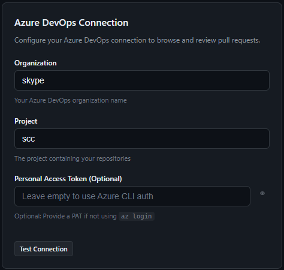

### 2. Link Local Repositories

Add local repository paths so the AI agent can use **git worktrees** for full context during reviews. This enables the AI to understand your entire codebase, not just the changed files.

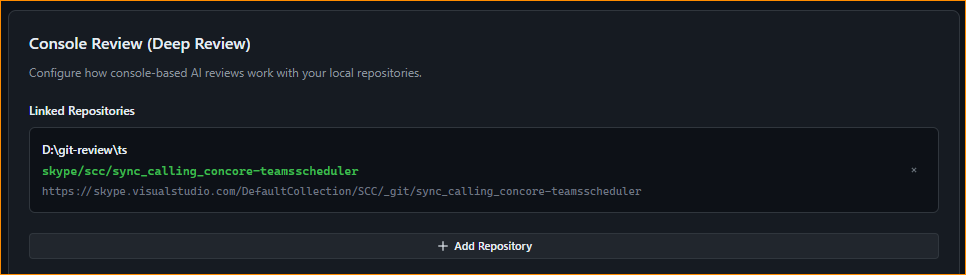

### 3. Monitor Repositories

Add repositories to monitor and automatically see all open PRs. You can track PRs from multiple repositories in one place.

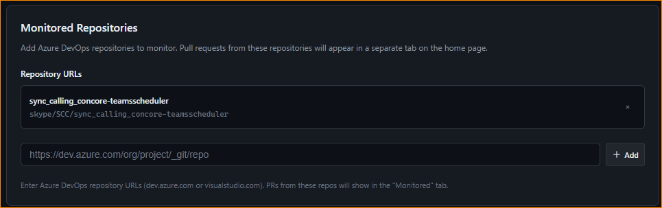

---

## PR Review Interface

### Browse Pull Requests

View all your assigned PRs, PRs you created, and PRs from monitored repositories. The interface provides quick access to PR details, status, and review actions.

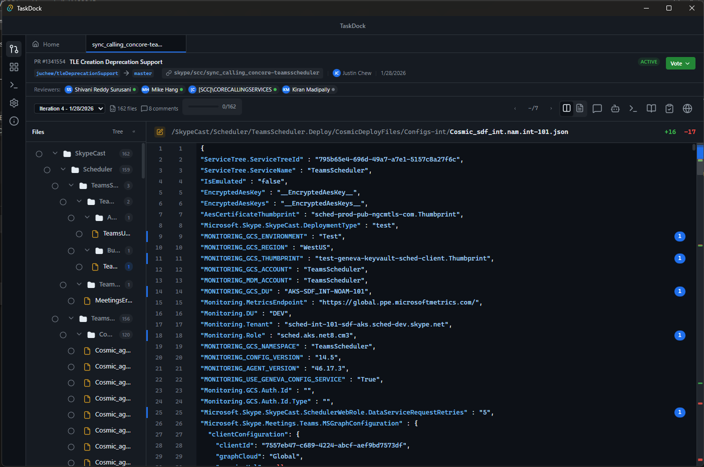

---

## AI-Powered Code Review

### Start an AI Review

Run AI reviews focused on what matters most to you:
- **Security** - Identify vulnerabilities and security issues
- **Performance** - Find performance bottlenecks and optimization opportunities
- **Bugs** - Detect potential bugs and edge cases
- **Code Style** - Ensure consistency with coding standards

You can also create **custom review prompts** for specific concerns:
- Null reference exceptions and null safety
- Backward compatibility with existing APIs
- SDP (Secure Development Practices) compliance
- Team-specific coding guidelines

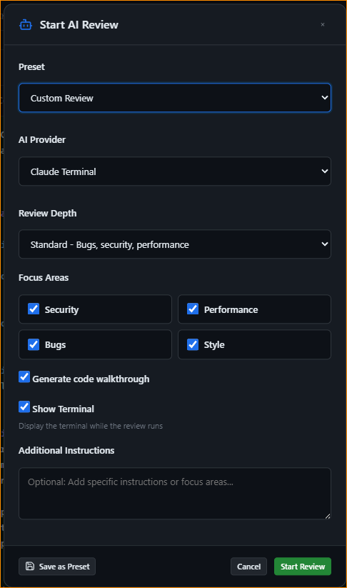

### Full Context Reviews

AI reviews run in a **git worktree** with full repository context. When enabled, reviews also include data from **WorkIQ** (Microsoft 365 integration) for additional context about related work items, discussions, and documentation.

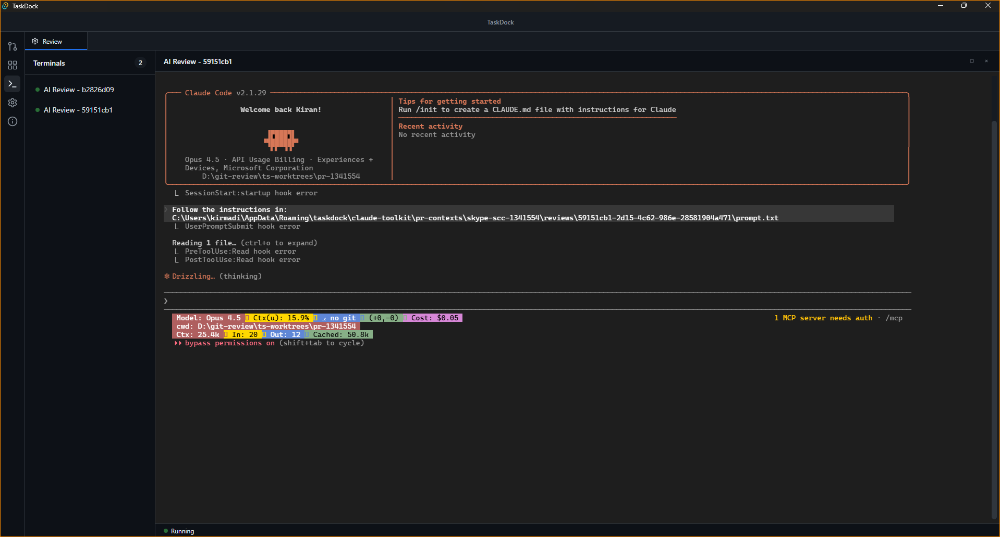

### Review Results

View AI-generated comments with:
- **Severity levels** - Critical, Warning, Suggestion, Praise
- **Categories** - Security, Performance, Bug, Style, etc.
- **Suggested fixes** - Code snippets you can apply directly

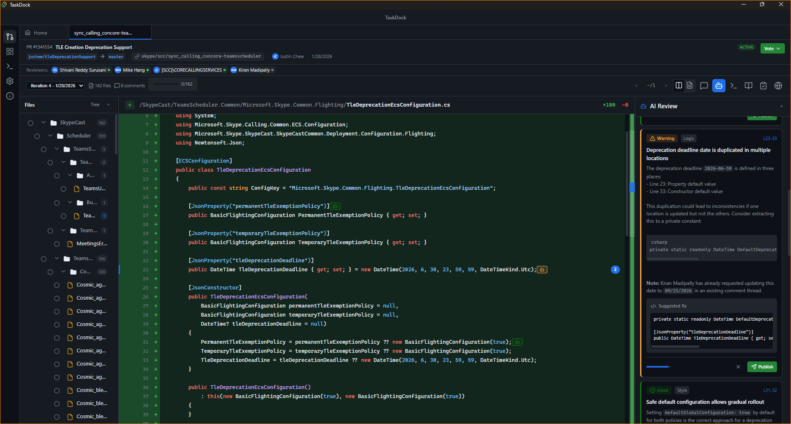

### Parallel Reviews

Run multiple reviews focused on different aspects of the PR simultaneously. For example, run a security audit and performance review at the same time.

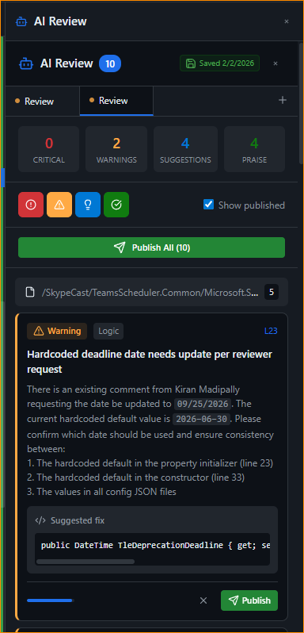

---

## AI Walkthrough

### Guided Code Walkthrough

Get a step-by-step guided walkthrough of the PR with AI-generated explanations. Perfect for understanding complex changes or onboarding to unfamiliar code.

Walkthroughs can be customized to focus on specific aspects:
- **Architecture Changes** - How the PR affects system design
- **Data Flow** - How data moves through the changed code
- **Testing Strategy** - What tests cover and potential gaps
- **Custom Focus** - Your own criteria (e.g., null safety, backward compatibility, SDP compliance)

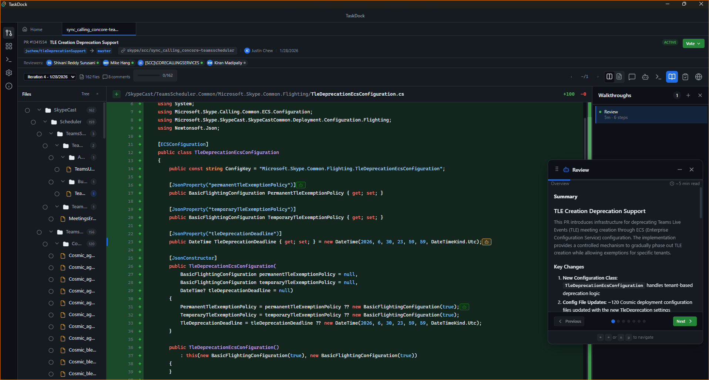

### Visual Architecture Diagrams

See visual representations of the PR changes with auto-generated Mermaid diagrams showing:
- Component relationships
- Data flow
- Architecture changes

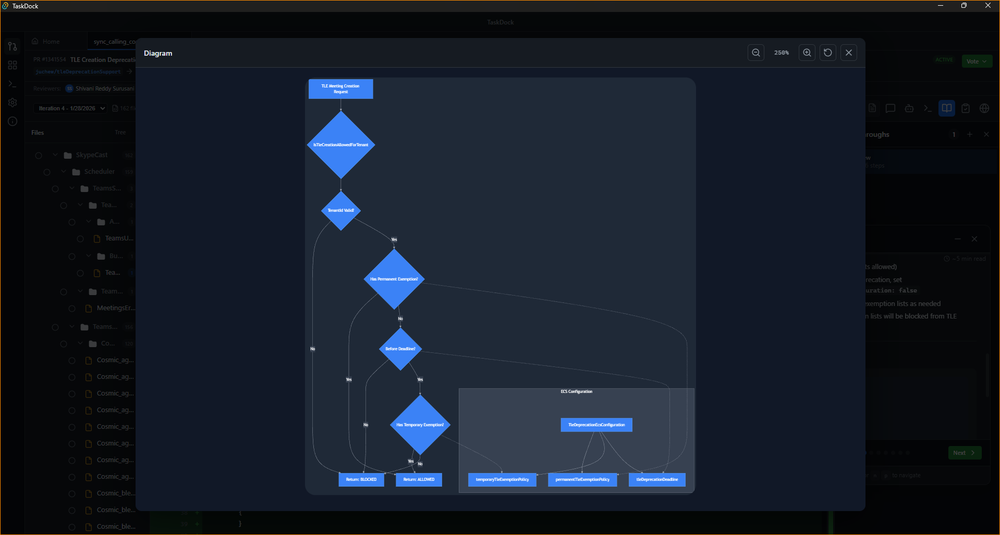

### Step-by-Step Explanations

Navigate through each change with detailed explanations of what the code does and why. The walkthrough highlights:
- Key changes and their impact
- Related files affected
- Design decisions

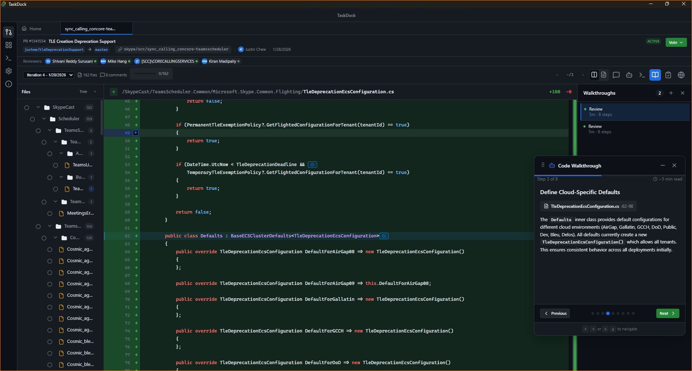

---

## PR Chat Copilot

### Ask Questions About the PR

Built-in copilot with full context to:
- The repository codebase
- PR changes and history
- WorkIQ data (emails, meetings, documents)

Ask natural language questions like:
- "What does this function do?"
- "Are there any security concerns with these changes?"
- "How does this relate to the feature request?"

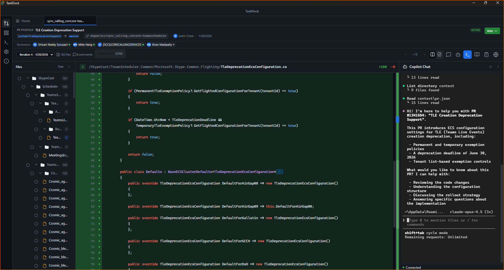

---

## Mermaid Diagram Support

### Auto-Generated Diagrams

Built-in support for Mermaid diagrams generated by the AI as part of design documentation. Diagrams are rendered inline for easy viewing.

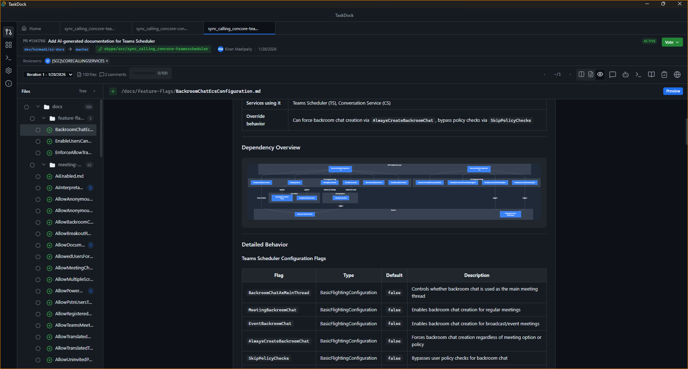

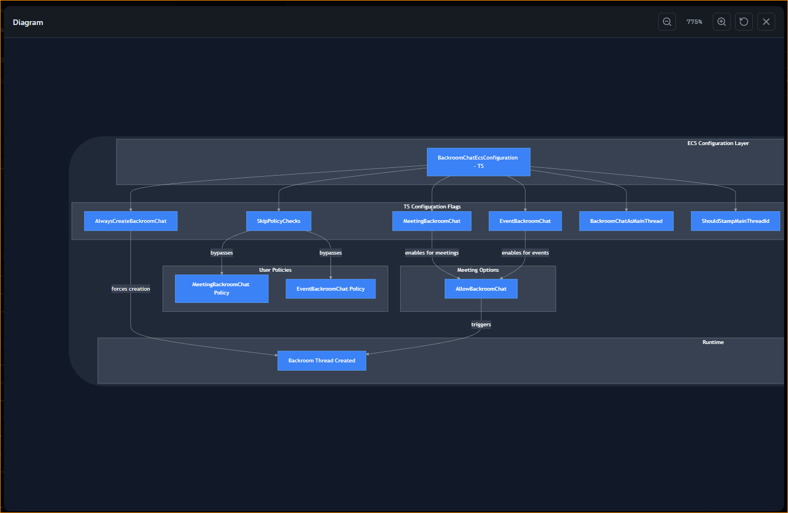

---

## Auto-Fix from Comments

### One-Click Fixes

Apply changes requested in PR comments from your peers at the click of a button. The AI understands the comment context and generates appropriate code fixes.

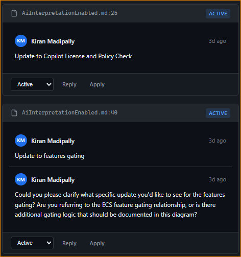

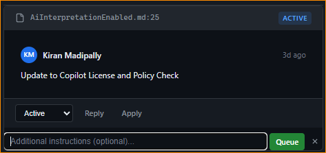

### Comment Triaging and Auto-Apply

Automatically analyze and triage comments with AI recommendations:
- **Fix** - Comment requires a code change
- **Reply** - Comment needs a response
- **Clarify** - Comment needs clarification

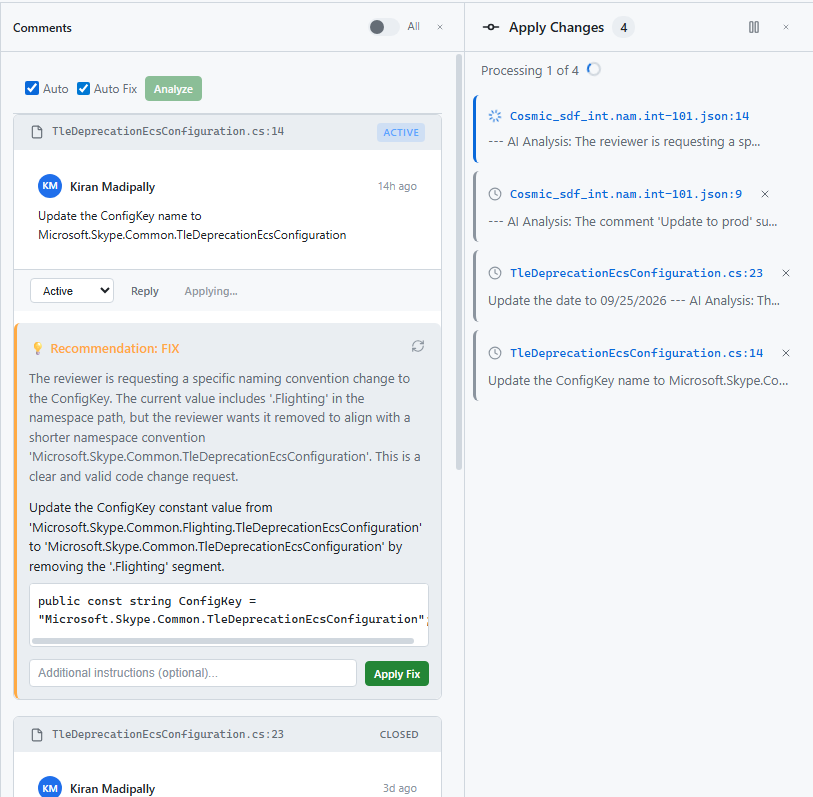

### Queued Commits

Applied changes are queued and committed **one change per commit** for clean history. Each commit includes:
- Clear commit message describing the fix
- Reference to the original comment
- Atomic, reviewable changes

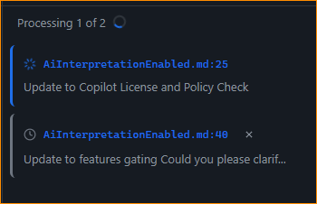

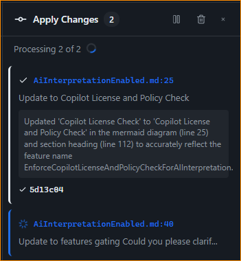

---

## Learn More

- [Full Feature List](README.md#features)
- [Developer Tools Setup](README.md#developer-tools-setup-windows)
- [Keyboard Shortcuts](README.md#keyboard-shortcuts)
